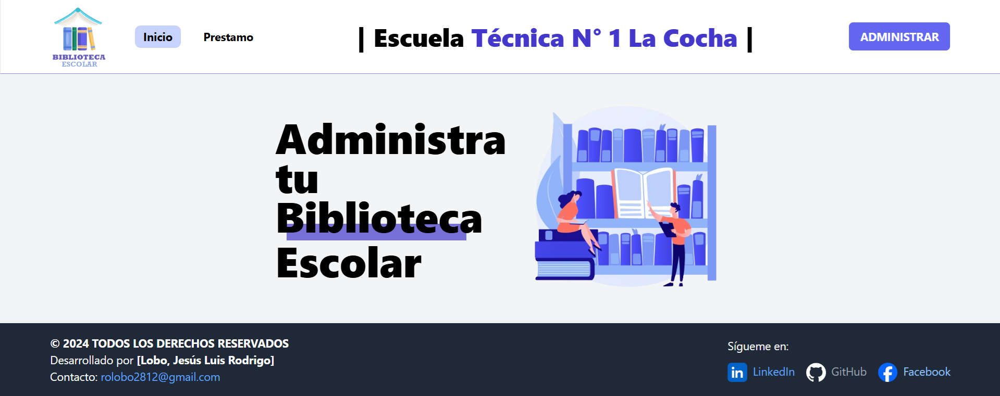

<!-- Banner -->



# 📚 APP LIBRARY - Administrador de Biblioteca Escolar

## 👋 ¡Hola y bienvenido a mi Proyecto!

**APP LIBRARY** es una aplicación web diseñada para la gestión eficiente de bibliotecas escolares. Con esta herramienta, puedes administrar libros y usuarios, realizar búsquedas avanzadas, y disfrutar de una interfaz intuitiva y fácil de usar.

## 🛠️ Tecnologías Utilizadas

- **React**: Para la construcción de la interfaz de usuario.
- **React Router DOM**: Para la navegación entre las distintas páginas de la aplicación.
- **TypeScript**: Mejora la calidad del código con tipos estáticos y detección de errores en tiempo de desarrollo.
- **Zod**: Para la validación de datos y esquemas de TypeScript.
- **Tailwind CSS**: Framework de CSS para diseñar una interfaz moderna y responsiva.
- **React Toastify**: Para mostrar notificaciones en tiempo real de manera amigable.

## 🎥 Demostración

Mira cómo funciona la aplicación desde la perspectiva del usuario en este [video de YouTube](https://www.youtube.com/watch?v=mI4y54a-GMw).

## ✨ Características Destacadas

- **Gestión de Libros y Usuarios**: Añade, modifica, y elimina registros de libros y usuarios de manera sencilla.
- **Búsqueda y Filtrado Avanzado**: Encuentra rápidamente los libros o usuarios utilizando funciones de búsqueda avanzada.
- **Validación de Datos y Manejo de Errores**: Validación en tiempo real para asegurar que los datos ingresados sean correctos.
- **Interfaz Intuitiva y Fácil de Usar**: Navegación simple y accesible para todos los usuarios.
- **Notificaciones en Tiempo Real**: Recibe alertas instantáneas sobre cambios y actualizaciones.


## 📂 Estructura del Proyecto

```bash
src/
├── components/       # Componentes reutilizables
├── data/             # courses and users
├── helpers/          # nowDate - nowTime
├── img/              # Imagenes
├── layouts/          # Layout principal
├── services/         # Servicios y lógica
├── types/            # Types de TypeScript
└── views/            # Páginas de la aplicación
```
## 🚀 Cómo Empezar
1. Clona el repositorio:

```bash
git clone https://github.com/RodrigoLoboDev/APP_LIBRARY_FRONTEND
```
2. Instala las dependencias:

```bash
npm install
```

3. Inicia el servidor de desarrollo:

```bash
npm run dev
```

## 🤝 Contribuciones
Las contribuciones son bienvenidas. Si tienes ideas para mejorar el proyecto, no dudes en abrir un issue o hacer un pull request.

## 📧 Contacto
- Email: rolobo2812@gmail.com
- LinkedIn: [Jesús Luis Rodrigo Lobo](https://www.linkedin.com/in/jes%C3%BAs-luis-rodrigo-lobo-6594a81b4/)
- GitHub: [RodrigoLoboDev](https://github.com/RodrigoLoboDev)

#### ⭐️ Si te gusta lo que hago, no dudes en seguirme y contribuir a mis proyectos. ⭐️